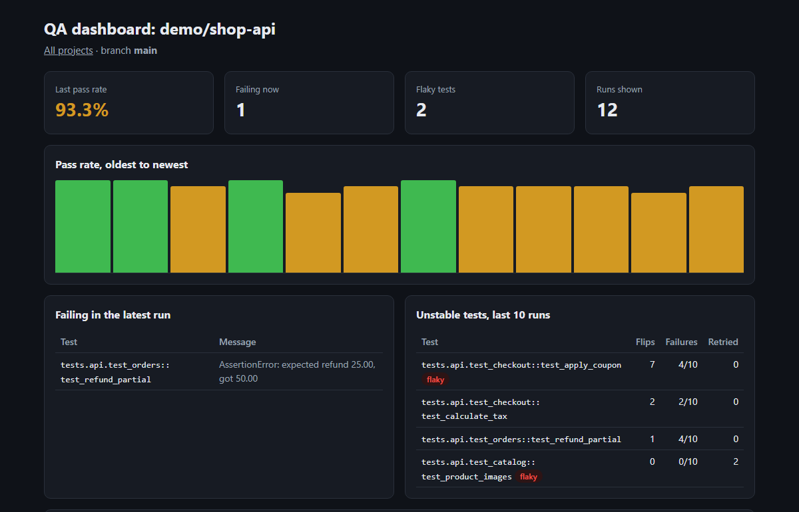
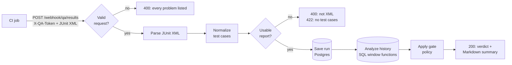

# CI Quality Gate & Flaky Test Detector

[](https://github.com/anuragsharma1098/n8n/actions/workflows/ci.yml)

A quality gate for CI pipelines, built as [n8n](https://n8n.io) workflows. A CI job sends its JUnit XML report; the gate stores the run in Postgres, compares it with the branch's history, and answers **passed** or **failed**. It tells new failures apart from known ones and recognizes flaky tests, so an unstable test doesn't block every build.

It's tested the way a production service would be: 51 automated tests, and a GitHub Actions pipeline that brings up the whole stack, runs them end to end, and then sends its own results through the gate.



## What it does

- **Reads JUnit XML** as written by pytest, Maven Surefire and other test runners, including nested suites and Surefire reruns (`<flakyFailure>`).
- **Classifies every failure** by comparing with the previous run on the same branch: *new failure*, *still failing*, or *fixed*.
- **Detects flaky tests**: a test is flaky if its result flipped between pass and fail at least 3 times in the last 10 runs, or if it only passed after a rerun.
- **Applies a gate policy**: fail on a new failure that isn't known to be flaky, or when the pass rate is below a threshold (95% by default, set per request). Known flaky tests are reported but don't block.
- **Answers CI** with JSON and a ready-made Markdown summary for the job's summary page.
- **Serves a dashboard** with the pass-rate trend, failing tests, flaky and unstable tests, slowest tests and recent runs.

## How it works

Two workflows in [`workflows/`](workflows):



- **QA Quality Gate: ingest JUnit results** (`POST /webhook/qa/results`). Protected by an API key in the `X-QA-Token` header.
- **QA Quality Gate: dashboard** (`GET /webhook/qa/dashboard`). A read-only HTML page with no scripts, where every value from a report is HTML-escaped.

Flakiness is computed in SQL: `lag()` over each test's results in the last 10 runs counts how often it flipped between pass and fail ([`workflows/qa-quality-gate.json`](workflows/qa-quality-gate.json), node *Analyze history*). The schema is in [`sql/schema.sql`](sql/schema.sql).

## Getting started

You need [Git](https://git-scm.com/downloads), [Docker Desktop](https://www.docker.com/products/docker-desktop/) (running) and [Python](https://www.python.org/downloads/) 3.10 or newer. The commands work in PowerShell, Terminal on macOS and Linux shells. On macOS and Linux, type `python3` where it says `python`.

**1. Get the code**

```bash
git clone https://github.com/anuragsharma1098/n8n.git
cd n8n
```

**2. Create your settings file**

```bash
python scripts/create_env.py
```

This creates `.env` with random passwords and keys. It stays on your computer, and git ignores it.

**3. Start n8n**

```bash
docker compose up -d --wait
```

This starts n8n, Postgres, Adminer and the Code-node runners. The first time, Docker downloads about 3 GB of images, so it can take a few minutes.

**4. Create your n8n account**

Open http://localhost:5678 and fill in the account form. The account is stored only in your local n8n, and it's the owner of this n8n.

**5. Import the workflows into your account**

```bash
python scripts/install_workflows.py
```

This creates the `qa_metrics` database, adds the two workflows and their credentials to your account, publishes the workflows, and restarts n8n (about 20 seconds). Refresh n8n: the workflows are under **Overview**. Running this before step 4 works too; the workflows become yours when you create the account.

**6. Run it**

Send a sample test report to the quality gate:

```bash
python scripts/publish_results.py tests/fixtures/pytest-report.xml --project my-first-try
```

It prints the verdict: **failed**, because 2 of the 5 tests that ran failed. Send the same report again with `--min-pass-rate 50` added and the gate passes: the two failures are no longer new, and 60% meets the threshold.

Then open the dashboard at http://localhost:5678/webhook/qa/dashboard. To see it with a longer history, load 12 demo runs and open the demo project:

```bash
python scripts/seed_demo_data.py
```

http://localhost:5678/webhook/qa/dashboard?project=demo/shop-api

**7. Watch a run inside n8n (optional)**

Open **QA Quality Gate: ingest JUnit results** in n8n and click **Execute workflow**. The editor then waits about 2 minutes for one report sent to the workflow's test URL. Send one with `--test`, and each node shows the data it received and produced:

```bash
python scripts/publish_results.py tests/fixtures/pytest-report.xml --project my-first-try --test
```

Reports sent without `--test` go to the published workflow. They don't appear on the canvas, but you can open each one from the workflow's **Executions** tab.

**Stopping and starting again:** `docker compose stop` stops everything and `docker compose up -d` starts it again. Your data is kept. For backups, updates and more, see [docs/operations.md](docs/operations.md). To send your own test results, see [Use it from CI](#use-it-from-ci).

## Use it from CI

[`scripts/publish_results.py`](scripts/publish_results.py) sends a report and exits with 0 when the gate passes, 1 when it fails, and 2 when the request fails. It's one file that uses only the Python standard library, so you can copy it into any repo. In GitHub Actions:

```yaml
- name: Quality gate
  env:
    N8N_URL: https://n8n.example.com
    QA_GATE_TOKEN: ${{ secrets.QA_GATE_TOKEN }}
    PROJECT: ${{ github.repository }}
    BRANCH: ${{ github.head_ref || github.ref_name }}
    COMMIT: ${{ github.sha }}
  run: >
    python scripts/publish_results.py reports/junit.xml
    --project "$PROJECT" --branch "$BRANCH" --commit "$COMMIT"
    --summary-file "$GITHUB_STEP_SUMMARY"
```

The values go through `env` rather than straight into the command because branch names come from pull requests, and putting them directly into a script allows [script injection](https://docs.github.com/en/actions/reference/security/secure-use#good-practices-for-mitigating-script-injection-attacks).

### API

`POST /webhook/qa/results` with header `X-QA-Token` and a JSON body:

| Field | Required | Meaning |
|---|---|---|
| `project` | yes | Project name, e.g. `org/repo`. No spaces. |
| `junit_xml` | yes | The JUnit XML report, as a string (up to 5 MB). |
| `branch` | no | Default `main`. History is kept per project and branch. |
| `commit` | no | Commit SHA, shown on the dashboard. |
| `build_url` | no | Link to the CI run. |
| `min_pass_rate` | no | Required pass rate in percent, 0 to 100. Default 95. Skipped tests don't count. |

Responses: **200** with the verdict, **400** for an invalid request or XML that isn't well-formed (every problem is listed), **403** for a missing or wrong API key, **422** for XML with no test cases. A 200 response looks like this (shortened; it also includes `summary_markdown`):

```json
{
  "run_id": 206,
  "previous_run_id": 157,
  "gate": "failed",
  "reasons": ["pass rate 66.67% is below the required 95%"],
  "stats": { "total": 3, "passed": 2, "failed": 1, "skipped": 0, "pass_rate": 66.67, "min_pass_rate": 95, "duration_ms": 3680 },
  "new_failures": ["tests.api.test_checkout::test_apply_coupon"],
  "still_failing": [],
  "fixed": [],
  "flaky": [{ "test_id": "tests.api.test_checkout::test_apply_coupon", "flips": 7, "failures": 4, "runs": 10, "passed_on_retry": 0 }],
  "failures": [{ "test_id": "tests.api.test_checkout::test_apply_coupon", "status": "failed",
                 "message": "AssertionError: expected total 45.00, got 50.00", "flaky": true }],
  "dashboard_url": "http://localhost:5678/webhook/qa/dashboard?project=demo%2Fshop-api&branch=main"
}
```

Here the coupon test failed after passing in the previous run, but it's known to be flaky, so it doesn't block. The gate still fails, because the pass rate is below 95%.

## Testing

| Layer | Tests | What they check | Needs n8n |
|---|---|---|---|
| Static ([`test_workflow_files.py`](tests/test_workflow_files.py)) | 10 | Every connection points at a real node, every Code node's JavaScript parses, the webhooks match the documented API, every path through the gate ends in a response, no pinned test data | No |
| End-to-end ([`test_quality_gate.py`](tests/test_quality_gate.py)) | 37 | Gate verdicts, new/still-failing/fixed classification, pass-rate threshold boundaries, flaky detection (flips, retries, per-branch history), pytest and Surefire reports, input validation, API-key checks, the Markdown summary | Yes |
| End-to-end ([`test_dashboard.py`](tests/test_dashboard.py)) | 4 | Project list, project page, empty state, HTML escaping of values from reports | Yes |

Every test sends its results under its own project name, so tests don't depend on each other and can run against a shared instance. JUnit reports are built with a small helper ([`junit_builder.py`](tests/junit_builder.py)), plus realistic pytest and Maven Surefire fixtures.

```bash
python -m venv .venv
source .venv/bin/activate               # Windows: .venv\Scripts\activate
pip install -r tests/requirements.txt
pytest -m "not e2e"                     # static checks, no n8n needed
pytest                                  # everything; needs the stack running and the workflows installed
```

**CI** ([`.github/workflows/ci.yml`](.github/workflows/ci.yml)) runs the static checks first, along with checks of `docker-compose.yml` and of the pipeline itself ([actionlint](https://github.com/rhysd/actionlint)), then the end-to-end job on a fresh stack. That job also checks the workflow files in the repo match what n8n stores (a workflow edited in the UI but not exported fails the build), and sends its own results through the gate so the verdict appears on the run's summary page.

**A bug the tests found:** with *On Error: Continue* turned on, n8n's XML node (n8n 2.40.7) puts the parser error in its input list instead of its output, so the error disappears and the workflow ends silently. A truncated report came back as an empty `200 OK`. The workflow now always emits an item from the XML node and checks the parse result itself, and three tests cover malformed XML.

## Project structure

```
workflows/              the two n8n workflows (import format)
sql/schema.sql          tables for the qa_metrics database
scripts/
  create_env.py         creates .env with random secrets
  install_workflows.py  sets up the database, credentials and workflows
  export_workflows.py   writes workflows edited in n8n back to workflows/
  publish_results.py    CI client: sends a report, prints the verdict
  seed_demo_data.py     demo history for the dashboard
tests/                  static and end-to-end tests, fixtures
docker-compose.yml      n8n, Postgres 18, Adminer and the Code-node runners
docs/operations.md      running the stack: backups, updates, Adminer, MCP
```

## Changing the workflows

Edit them in the n8n editor, then run `python scripts/export_workflows.py` and commit the changed files in `workflows/`. The export keeps only the fields that define a workflow, so files don't change because of timestamps or version IDs.

## Limitations

- In CI the database starts empty on every run, so the dogfooding verdict has no history to compare against. Point `N8N_URL` at a long-running n8n to build up real trend data.
- The dashboard has no login. Keep n8n on localhost or put it behind your own authentication before exposing it.
- The flaky rule is a heuristic, and a test's identity is `classname::name`, so a renamed test starts a new history.

## Running the stack

Backups, restores, updates, Adminer, Code-node limits and connecting Claude Code over MCP are covered in [docs/operations.md](docs/operations.md).
